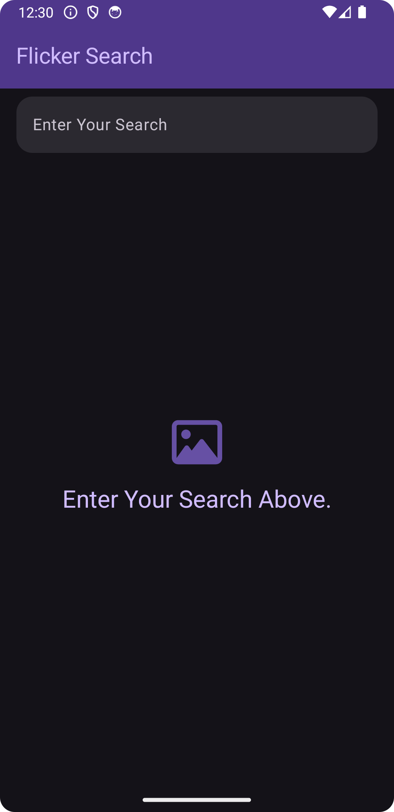

# Flicker Search App
* This is a very simple Image search app utilizing Android's Jetpack Compose
* This project uses Flicker's public feed API https://www.flickr.com/services/feeds/docs/photos_public/

## Screenshots

